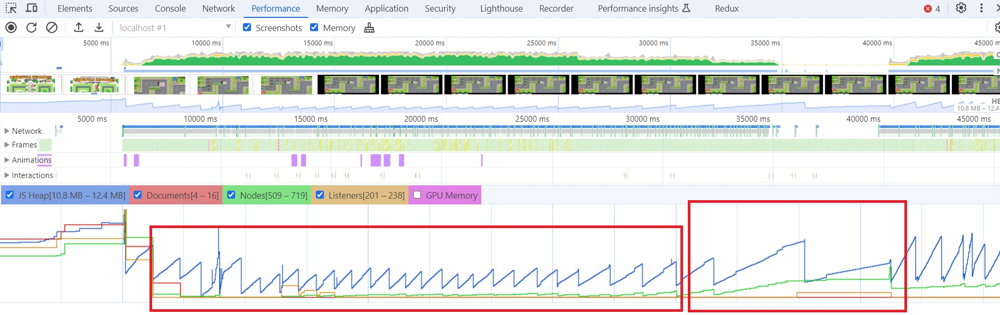

# Утечки памяти
Больших скачков или постоянного роста потребления памяти не обнаружено.

В процессе игры JS Heap увеличивается незначительно, всегда возвращаясь к изначальным значениям.

На 35 секунде произведен нагрузочное тестировани: было выставлено подряд 5 башен, при этом произошло увеличение Nodes и JS Heap с последующем возвращением к начальному уровню.

