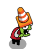
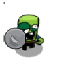
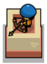

# Сценарий игры <!-- omit in toc -->

Игрок может расставлять башни для обороны от монстров, которые идут по заданному пути.
Цель игры не дать монстрам пройти до конца карты, лимит пропущенных зомби задан жизнями(10).
Eсть 3 волны нападения с возрастающим количеством врагов.
Башни покупаются за монеты, монеты получаем за убитых врагов.
Доступен апгрейд каждой башни на 1 уровень. Есть возможность продать башни.

_Типы врагов:_

|                 Враг                  | Описание                                                                         |
|:-------------------------------------:|:---------------------------------------------------------------------------------|
|    | Conezombie - враг имеет умеренные характеристики здоровья и скорости.            |
|    | Shieldzombie - враг имеет улучшенные характеристики здоровья, но меньшую скорость. |

_Типы башен:_

|                Башня                | Описание                                                                                                                    |
|:-----------------------------------:|:----------------------------------------------------------------------------------------------------------------------------|
|     | ArcherTower - умеренные боевые характеристики.Можно продать или улучшить.                                                   |
|  |  TeslaTower - Башня имеет улучшенные характеристики скорости атаки, урона, но большую цену постройки и стоимость улучшения. |

_TODO:_

- [ ] Добавить больше вариантов врагов с особенностями поведения.
- [ ] Добавить больше башен, а также 5 уровней апгрейда для каждой башни.

_Хотелки:_

- [ ] Реализовать карту с новым маршрутом.
- [ ] Добавить механику боссов.

