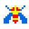
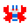
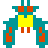

# Сценарий игры <!-- omit in toc -->

Игрок управляет кораблем в нижней части экрана, который двигается влево и вправо, а так же может стрелять.
Цель игры набрать как можно больше очков, игра бесконечная с постепенно повышающейся сложностью.
Имеется несколько уровней, которые сменяют друг друга после уничтожения всех врагов на экране.
Разница в уровнях это расположение и количество врагов разного типа. Также в игре присутствуют бонусные
уровни где игроку ничего не угрожает, он ограничен только временен. Во время бонусных уровней игрок может подобрать
улучшение для своего оружия (скорострельность, по 3 ракеты с разлетов (веерный огонь), и т.д.).
За набранные очки начисляются жизни, например каждые 4000 очков, жизней не может быть больше 3-х,
если у игрока уже три жизни ему начисляются бонусные очки 500.

В начале каждого уровня рой инопланетян в форме жуков атакует игрока, перемещаясь в верхней
части экрана. Скорость роя от уровня к уровню увеличивается, однако при определенном наборе врагов может быть снижена.

Существует несколько видов жуков, например:

|               Враг               | Описание                                                                                                                                                |
| :------------------------------: | :------------------------------------------------------------------------------------------------------------------------------------------------------ |
|  | Базовый враг, в основном передвигается вместе с роем но иногда может отделяться и совершать налет на игрока. Редко стреляет.                            |
|  | Враг второго уровня, так же передвигается вместе с роем, отделается чаще для совершения налетов на игрока. Стреляет чаще.                               |
|  | Враг третьего уровня, передвигается вместе с роем, стреляет чаще чем враг второго уровня, может похитить корабль игрока. Уничтожается с двух попаданий. |

_TODO:_

- [ ] Добавить больше вариантов врагов с особенностями поведения.
- [ ] Нарисовать/найти другие изображения врагов с анимацией.

_Хотелки:_

- [ ] Реализовать появление в случайных местах игрового поля предметов по которым необходимо кликнуть мышью, дают какие-нибудь бонусы.
- [ ] Добавить механику боссов.
- [ ] Добавить различные задние фоны, как будто меняется область космоса где происходит сражение
